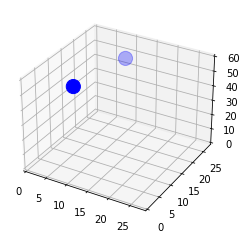

### August Van Hout
 
 
 

-----
# Neuron Field

## Overview
This project seeks to explore whether we can use more brain-like 3D neuron structures to make predictions.

In doing so, while we are not able to make predictions (yet!) we are certainly able to create objects in space which behave surprisingly like a brain's neurons. 

In this readme, we'll cover:
 
- Neurons and NeuronFields
- Input Neurons
- Field Neurons
- Output Neurons
- Prediction

## Neurons and NeuronFields
### Neurons  

Neurons and NeuronField are objects. NeuronFields contain neurons, and have functionality for instantiating and manipulating neurons systematically.

Neurons are instantiated, placed in space, and made to interact with their neighbors. 
They read their neighbors' values and then set their own value as a result. After instantiating a NeuronField, 
functions are be called within that NeuronField to fill it with neurons.

There are Input, Field, and Output neurons by default.     
Input neurons are made to stimulate an area of the field without reading neighbors. By default, they take 
an image and place it near the bottom of the field. 

Field neurons exist in the 3D field and connect to a group of neighbor. Then, by default, they read their 
neighbor's values and use a DNN to determine their own value.

Output neurons are few (likely <5), are located near the top of the field, and take the mean of nearby activity.

Neurons have two locations associated with them: Cell body location (loc) and axon location (axon_loc). The cell body 
is the area around which neighbors will be read. The axon location is the point where the neuron will put its own 
value. The axon is extended away from the center. Neurons cannot read their own axons.

### NeuronFields

NeuronFields hold neuron information and facilitate interactions. They are used to create a 3D matrix, fill it with Field neurons which interact with one another, place input neurons for stimulating the bottom of the field, and placing output neurons at the top for recording outputs. They also gather and hold information about the neurons and field, prediction and accuracy scores, and more.
    

To instantiate a NeuronField, try the following code:

<code>
    nf_test = NeuronField(input_size = 28, 
                      field_size = 28, 
                      output_size = 2,
                      k_neurons = 500, 
                      min_dendrites = 4, 
                      dendrite_radius = 5, 
                      axon_length = 8
                     )
</code>

## Input Neurons  

The idea of an input neuron is to take an image and represent it as high values on the field. We do this by attaching input neurons to the image and setting their axon outputs to the value (darkness) of that pixel. 
 
 

Input neurons are instantiated in a two dimensional location. This location is which pixel they represent! Their axons are then placed on the bottom of the field. This way, they pass information from the input image to the field neurons.
  

## Field Neurons 
Field neurons are placed randomly around the field, and their function is to alter and transfer signals. They read their neighbors' values, run those values through a tiny random DNN (by default), and use the output to set their own axon value.

There are lots of interesting and challenging implications for neurons activating one another in 3D. 
Neurons activate in steps. In one step, the neurons:
- read their neighbors
- decide their own value
- change their axon output

Field neurons have potential to be used and modified in the future. Even now, it is possible to remove them mid-use, relocate their axons, alter them with new types of activation models, and even assign them files to hold.

## Output Neurons 
Output neurons are positioned near the top of the field in a circle, equistant from one another. Rather than any activation function, they simply take the mean of their neighbors' outputs. In this way, we can see which area is more active and use this information to make predictions or influence decisions.

Output neurons hold potential as well. They could be arbitrarily relocated wherever we wish, or in many different places. We may be able to use their values as inputs to in ensemble models.

To instantiate all neurons in a new NeuronField, try the following code:

<code>
    nf_test.initiate_field()
</code>
 
To explore the NeuronField's dictionary of all neurons, explore <code>test_df.neuron_dict</code>. To see all neurons' basic information in a dataframe, try the following code:
 
<code>
    nf_test.gather_neuron_data(["input", "field", "output"])
    nf_test.neuron_df
</code>
 

### 

## Prediction 
We can use the NeuronField for prediction by reading the output neurons. 

The package has functionality for predicting many records, though there is not yet a way to actually train the model. Because of this, the model tends to predict the same answer every time, especially after many firing steps.

In order to predict the identity of many images, use the <code>predict</code> method. Pass it an itterable of image matrices and an array of numeric labels (X_data and y_data), as well as the number of records to predict and the number of firing cycles to execute for each image.

After calling <code>NeuronField.predict()</code> method, try accessing the output information using <code>NeuronField.output_df</code>.  

Try the following:
 

<code>
    X_train, y_train = get_mnist_data([0,1])
    nf_test.predict(X_data = X_train, y_data = y_train, records = 5, steps = 10)
    nf_test.output_df
</code>
 

|image_id	|step	|1284	|1285	|prediction	|y	|y_neuron	|is_correct|
|-----------|-------|-------|-------|-----------|---|-----------|----------|
|0	|7	|10	|3.675371e+06	|1.511822e+07	|1285	|1	|1285	|True|
|0	|8	|10	|0.000000e+00	|0.000000e+00	|1285	|0	|1284	|False|
|0	|9	|10	|0.000000e+00	|0.000000e+00	|1285	|0	|1284	|False|
|0	|10	|10	|0.000000e+00	|0.000000e+00	|1285	|1	|1285	|True|
|0	|11	|10	|0.000000e+00	|0.000000e+00	|1285	|0	|1284	|False|

### Deveolopment of this Package

I'm very excited for the implications of this work. In short, this is the product of itterative attempts to accomplish brain-like activity in a three dimensional space over the course of two weeks.

Fruit flies have around 1,500 neurons. If all that is needed is to travel towards fruit hormones, eat, lay eggs, and escape from pain, it seems possible to achieve similar results someday with a well-made, purpose-built neuron field and just a few basic inputs and outputs. I think the future of the package is ensemble models, transfer learning, and reinforcement learning to shape and train the network.

One hindrance is speed. The package was rewritten twice to vectorize as much as possible, but it still requires loops and is too slow for practical applications. A second thing that strikes me is the potential for distributed work, especially if we can make neurons act independently.

I encourage any interested person to take this package for a test drive, and to crash it for science. Anyone with the inclination to change the internals of the package will find a few "blank slate" building blocks, functionality ready to accept changes, and documentation for every function and class.

Happy coding,  
 
*August VanHout*  
augustvanhout@gmail.com

## Citations

- Online Project Resources:
    - http://www.scholarpedia.org/article/Neural_fields
    - https://www.embibe.com/exams/neuron/
    - https://stackoverflow.com/questions/51527868/how-do-i-embed-a-gif-in-jupyter-notebook
    - https://stackoverflow.com/questions/6046263/how-to-indent-a-few-lines-in-markdown-markup
    - https://en.wikipedia.org/wiki/Feedforward_neural_network
    - https://ml-cheatsheet.readthedocs.io/en/latest/activation_functions.html
    - https://intellipaat.com/community/253/role-of-bias-in-neural-networks
    - https://builtin.com/machine-learning/backpropagation-neural-network
    - https://realpython.com/python-assert-statement/
    - https://towardsdatascience.com/activation-functions-neural-networks-1cbd9f8d91d6
    - https://stackoverflow.com/questions/3985619/how-to-calculate-a-logistic-sigmoid-function-in-python
    - https://stackoverflow.com/questions/32109319/how-to-implement-the-relu-function-in-numpy
    - https://en.wikipedia.org/wiki/Axon
    - https://www.embibe.com/exams/neuron/
    - https://alexlenail.me/NN-SVG/

Special thanks to:
- Instructors at General Assembly:
    - Tim Book
    - Katie Sylvia
    - Loren Dunn
    - Rowan Schaefer 
    
- Friends and Family:
    - John Charles for some late-evening calculus headscratching
        - Jonathan.charles9494@gmail.com, https://github.com/CharlesTheAnimator
    

